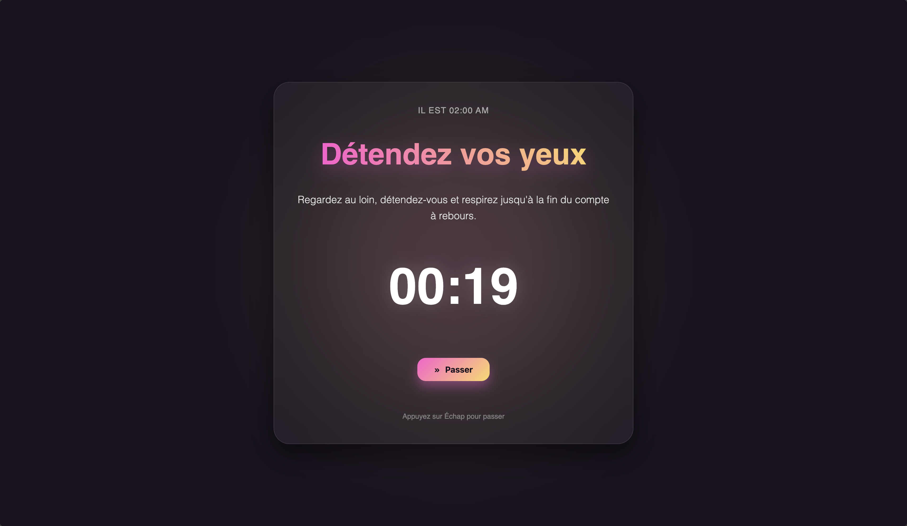
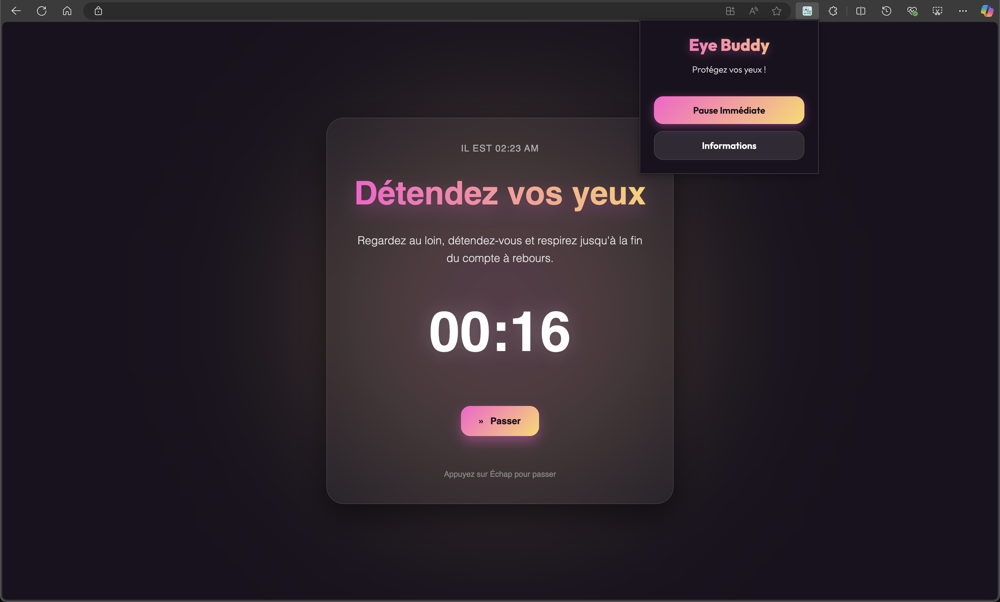

# 👁️ Eye Buddy

> **Protégez vos yeux avec style.**  
> L'extension Chrome ultime pour appliquer la règle des 20-20-20 et réduire la fatigue visuelle.



---

## ✨ Pourquoi Eye Buddy ?

Nous passons tous trop de temps devant nos écrans. La fatigue oculaire numérique est réelle.  
**Eye Buddy** est là pour vous rappeler de faire une pause, mais pas n'importe comment : avec une interface **magnifique**, **apaisante** et **moderne**.

### 🚀 Fonctionnalités Clés

*   **⏱️ Règle 20-20-20 Automatisée** : Toutes les 20 minutes, une pause de 20 secondes vous est proposée.
*   **🎨 Design Premium "Dark Plum"** : Une interface sombre et élégante avec des dégradés vibrants Rose/Jaune, inspirée des meilleures apps de méditation.
*   **🌫️ Ambiance Zen** : Un fond animé avec un flou gaussien apaisant pour une immersion totale.
*   **🔔 Notifications Discrètes** : Soyez averti en douceur quand il est temps de reposer vos yeux.
*   **🔒 Règle Stricte** : Pas de configuration complexe, l'extension applique strictement le rythme optimal de 20 minutes / 20 secondes.
*   **🖱️ Effet Parallax 3D** : L'interface réagit subtilement aux mouvements de votre souris pour un effet de profondeur unique.

---

## 📸 Aperçu du Menu



Le menu de l'extension (Popup) est votre centre de contrôle rapide :
*   **Pause Immédiate** : Lancez instantanément l'écran de relaxation pour tester l'effet ou prendre une pause volontaire.
*   **Informations** : Apprenez plus sur la règle des 20-20-20 et comment elle peut vous aider.

---

## 🛠️ Installation (Mode Développeur)

Pour l'instant, Eye Buddy est en phase de développement. Voici comment l'installer sur votre navigateur Chrome, Brave ou Edge :

1.  **Clonez ce dépôt** :
    ```bash
    git clone https://github.com/bastianfbr/EyeBuddy.git
    ```
2.  Ouvrez votre navigateur et allez sur la page des extensions :
    *   Chrome : `chrome://extensions`
    *   Edge : `edge://extensions`
3.  Activez le **Mode développeur** (souvent un switch en haut à droite).
4.  Cliquez sur le bouton **"Charger l'extension non empaquetée"** (Load unpacked).
5.  Sélectionnez le dossier `EyeBuddy` que vous venez de cloner.

🎉 **C'est tout !** L'icône Eye Buddy devrait apparaître dans votre barre d'outils.

---

## ⚙️ Technologies

Développé avec ❤️ et les dernières normes web :

*   **Manifest V3** : Pour une sécurité et une performance optimales.
*   **Vanilla JS** : Léger et rapide, sans frameworks lourds.
*   **CSS3 Moderne** : Gradients, Backdrop Filter, Animations, 3D Transforms.

---

## 🤝 Contribuer

Les yeux fatigués du monde entier vous remercieront ! N'hésitez pas à proposer des Pull Requests pour :
*   Ajouter de nouveaux thèmes.
*   Améliorer les exercices de relaxation.
*   Traduire l'extension.

---

*Fait par bastianfbr* 🌟
